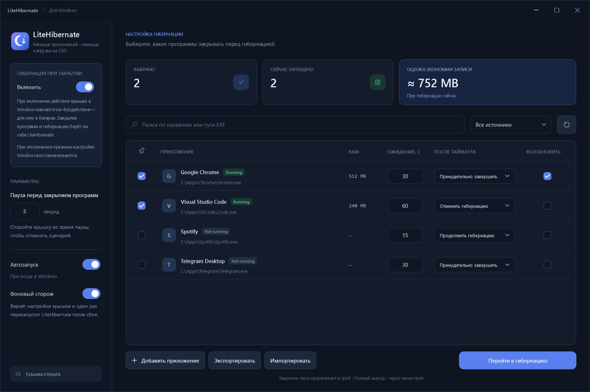

<div align="center">

# LiteHibernate

**Меньше приложений – меньше нагрузка на SSD**


[](LICENSE)

</div>

LiteHibernate закрывает выбранные приложения перед гибернацией – при закрытии крышки ноутбука или вручную.

Гибернация позволяет выключить ноутбук, сохранив сеанс, но для этого Windows записывает данные из оперативной памяти на диск. LiteHibernate автоматически закрывает выбранные приложения, чтобы освободить память и уменьшить объём записи на SSD.

Работает и на ПК – через кнопку «Перейти в гибернацию».



## Как пользоваться

Распакуйте архив и запустите `LiteHibernate.exe`. Установка не нужна.

1. Отметьте приложения для закрытия.
2. Задайте время ожидания и действие после истечения таймаута закрытия.
3. Включите «Гибернация при закрытии» или нажмите «Перейти в гибернацию».

Отмена доступна во время начальной паузы (по умолчанию 5 секунд). Как только выбранные приложения завершатся, начнётся гибернация.

## Возможности

- Штатное завершение приложений, включая программы в трее.
- После таймаута завершения приложения: отменить гибернацию, принудительно завершить приложение или продолжить гибернацию.
- Поиск установленных и запущенных программ, добавление EXE вручную.
- Статус, потребление RAM и приблизительная оценка экономии записи на SSD.
- Автоматическая сортировка по RAM и закрепление порядка строк.
- «Возобновить» – открыть завершённое приложение после гибернации.
- «Скрыть» – убрать приложение из списка; вернуть его можно через «Скрытые» -> «Показать».
- Работа в трее, автозапуск, импорт и экспорт настроек приложений.

## Важно

При включении «Гибернация при закрытии» LiteHibernate устанавливает для крышки «Бездействие» от сети и батареи, потому что обработку её закрытия берёт на себя приложение. При отключении или выходе через трей восстанавливает исходные настройки. После сбоя сторож возвращает настройки и один раз перезапускает LiteHibernate. Если перезапуск не удался, повторно восстанавливает настройки, показывает уведомление и записывает ошибку в лог.

Крестик сворачивает окно в трей. Гибернация должна быть доступна в Windows. Системные процессы и службы не закрываются.

Настройки: `%LocalAppData%\LiteHibernate`.

Лог: `%LocalAppData%\LiteHibernate\Logs\events.log`.

## Сборка и тесты

Нужны Windows x64 и .NET SDK 10.

```powershell
dotnet build LiteHibernate.slnx -c Release
dotnet run --project tests/LiteHibernate.Tests -c Release --no-build -- --integration
powershell -NoProfile -ExecutionPolicy Bypass -File ./scripts/Publish-Portable.ps1
```

[GitHub Actions](.github/workflows/ci.yml) проверяет сборку и тесты на Windows.

Автор: [REYIL](https://github.com/REYIL). Лицензия: [MIT](LICENSE).
